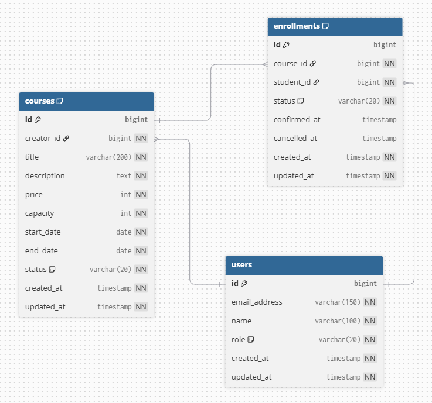

# 데이터 모델

## 개요

핵심 데이터 모델은 `User`, `Course`, `Enrollment` 세 가지입니다.

- `User`: 시스템 사용자이며 역할(`CREATOR`, `STUDENT`)을 가집니다.
- `Course`: 크리에이터가 개설한 강의입니다.
- `Enrollment`: 학생의 수강 신청/대기열/확정/취소 이력을 표현하며 `Course`와 `User`를 연결합니다.

모든 엔티티는 `AbstractEntity`를 상속하며 공통 식별자 `id`를 가집니다.

## 관계

- `User(creator)` 1 : N `Course`
- `User(student)` 1 : N `Enrollment`
- `Course` 1 : N `Enrollment`

즉, 한 명의 크리에이터는 여러 강의를 개설할 수 있고, 한 명의 학생은 여러 수강 신청을 가질 수 있으며, 하나의 강의에는 여러 수강 신청이 연결될 수 있습니다.

## 사용자(User)

### User

#### 속성

- `id`: Long
- `email`: `Email`
- `name`: String
- `role`: `UserRole`
- `createdAt`: LocalDateTime
- `updatedAt`: LocalDateTime

#### 행위

- `static register(email, name, role)`: 사용자를 등록합니다.

#### 규칙

- 이메일은 유효한 형식이어야 합니다.
- 이메일은 시스템 내에서 유일해야 합니다.
- 역할은 `CREATOR` 또는 `STUDENT`만 허용합니다.

### Email

_Value Object_

#### 속성

- `address`: 이메일 주소

#### 규칙

- 정규식을 통해 이메일 형식을 검증합니다.

### UserRole

_Enum_

#### 상수

- `CREATOR`: 강의 개설 및 관리가 가능한 사용자
- `STUDENT`: 수강 신청, 대기열 등록, 결제 확정, 수강 취소가 가능한 사용자

## 강의(Course)

### Course

#### 속성

- `id`: Long
- `creator`: `User`
- `title`: String
- `description`: String
- `price`: Integer
- `capacity`: Integer
- `startDate`: LocalDate
- `endDate`: LocalDate
- `status`: `CourseStatus`
- `createdAt`: LocalDateTime
- `updatedAt`: LocalDateTime

#### 행위

- `static create(creator, title, description, price, capacity, startDate, endDate)`: 강의를 생성합니다.
- `open()`: 강의를 모집 상태로 전환합니다.
- `close()`: 강의를 모집 마감 상태로 전환합니다.

#### 규칙

- 강의 생성 시 상태는 `DRAFT`입니다.
- 가격은 `0` 이상이어야 합니다.
- 정원은 `1` 이상이어야 합니다.
- `startDate`는 오늘보다 과거일 수 없습니다.
- `startDate`는 `endDate`보다 늦을 수 없습니다.
- 상태 전이는 `DRAFT -> OPEN -> CLOSED`의 단방향 흐름을 가집니다.
- `OPEN` 상태의 강의만 수강 신청 또는 대기열 등록이 가능합니다.

### CourseStatus

_Enum_

#### 상수

- `DRAFT`: 초안 상태, 신청 불가
- `OPEN`: 모집 중, 신청 가능
- `CLOSED`: 모집 마감, 신청 불가

## 수강 신청(Enrollment)

### Enrollment

#### 속성

- `id`: Long
- `course`: `Course`
- `student`: `User`
- `status`: `EnrollmentStatus`
- `confirmedAt`: LocalDateTime
- `cancelledAt`: LocalDateTime
- `createdAt`: LocalDateTime
- `updatedAt`: LocalDateTime

#### 행위

- `static apply(course, student)`: 수강 신청을 생성합니다.
- `static waitlist(course, student)`: 대기열 등록을 생성합니다.
- `promoteToPending()`: 대기열 등록을 `PENDING` 상태로 변경합니다.
- `confirm()`: 결제 확정 처리로 상태를 `CONFIRMED`로 변경합니다.
- `cancel()`: 수강 취소 처리로 상태를 `CANCELLED`로 변경합니다.

#### 규칙

- 수강 신청 생성 시 기본 상태는 `PENDING`입니다.
- 대기열 등록 생성 시 기본 상태는 `WAITING`입니다.
- `WAITING` 상태는 자리 발생 시 `PENDING`으로 변경할 수 있습니다.
- `PENDING` 상태에서만 `CONFIRMED`로 전이할 수 있습니다.
- 수강 취소는 `PENDING`, `WAITING`, `CONFIRMED` 상태에서 가능합니다.
- `CONFIRMED` 상태의 취소에는 결제 확정일과 강의 시작일 기준의 기간 제한이 적용됩니다.
- `CANCELLED` 상태는 다시 취소할 수 없습니다.
- 활성 수강 신청 인원은 `PENDING`, `CONFIRMED`만 포함합니다.
- `WAITING`, `CANCELLED`는 정원 계산에서 제외합니다.

### EnrollmentStatus

_Enum_

#### 상수

- `PENDING`: 신청 완료, 결제 대기
- `WAITING`: 정원 초과로 대기열 등록
- `CONFIRMED`: 결제 완료, 수강 확정
- `CANCELLED`: 취소됨

## 도메인 규칙

- 강의 정원 검증은 `Enrollment` 개별 상태가 아니라 강의별 활성 수강 신청 집계로 판단합니다.
- 같은 학생은 같은 강의에 대해 `PENDING`, `WAITING`, `CONFIRMED` 상태를 중복으로 가질 수 없습니다.
- 취소된 신청은 정원에서 제외되므로 취소 후에는 동일 강의에 다시 신청할 수 있습니다.
- 수강 신청과 대기열 등록, 취소 후 대기열 승급은 모두 같은 강의 락을 기준으로 처리해 동시성 문제를 줄였습니다.
- 대기열 등록은 정원이 실제로 가득 찬 경우에만 허용합니다.
